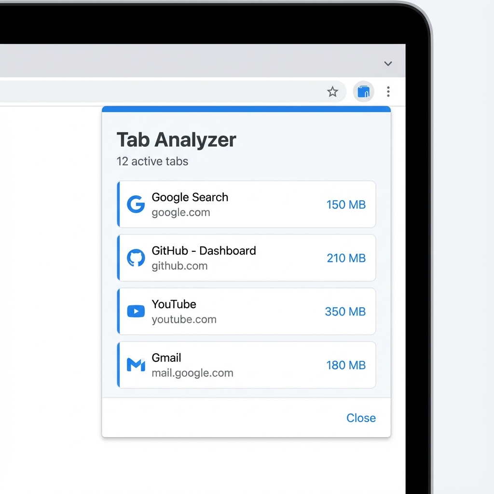

# Tab & Memory Analyzer Chrome Extension

A minimalist Chrome Extension (Manifest V3) that helps you monitor and manage your browser's memory usage. It analyzes all open tabs and displays their memory footprint, allowing you to identify and close resource-heavy pages.

## Features

- **Real-time Tab Analysis**: Lists all active tabs.
- **Memory Monitoring**: Displays estimated memory usage per tab (in MB).
- **Process Mapping**: Intelligently maps shared renderer processes to domains.
- **One-Click Cleanup**: Close tabs directly from the popup.
- **Privacy-First**: Runs entirely locally using Chrome native APIs. No external analytics.

## Installation

1. Clone this repository or download the ZIP.
2. Open Chrome and navigate to `chrome://extensions`.
3. Enable **Developer mode** in the top right corner.
4. Click **Load unpacked**.
5. Select the extension directory.

## Requirements

- Google Chrome (Desktop)
- For full memory details: Chrome Dev/Canary channel or specific flags may be required for `chrome.processes` API.
  - *Fallback*: If the API is unavailable, the extension will display System Memory usage and list tabs without per-tab precision.

## Permissions

- `tabs`: To list and close tabs.
- `processes`: To analyze memory usage of renderer processes.
- `system.memory`: To display global system memory stats.

## License

MIT License.
